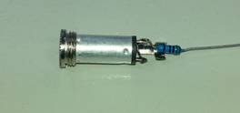

# Ultrasonic Distance and Compass Reader

I had previously developed a little project which used an  ultrasonic distance sensor and a clever little library called ‘talkie’. This  project measured the distance in front of the sensor and then read it out- the  sort of thing that could be used to help a visually impaired person navigate.  Now I’ve included the Duinotech XC4496 compass module, so that the Reader can  read out compass bearing and distance.

## Components

|Qty| Code | Description |
|---|---|---|
|1 | [XC4410](http://jaycar.com.au/p/XC4410) | UNO main board
|1 | [XC4442](http://jaycar.com.au/p/XC4442) | ultrasonic sensor
|1 | [WC6028](http://jaycar.com.au/p/WC6028) | plug to socket jumper leads
|1 | [XC4496](http://jaycar.com.au/p/XC4496) | magnetic compass module
|1 | [PS0134](http://jaycar.com.au/p/PS0134) | stereo line socket
|1 | [RR0552](http://jaycar.com.au/p/RR0552) | 150R resistor pack

* [AA2090 Stereo Headphones](https://jaycar.com.au/p/AA2090)
(if you don't have headphones)

## Connections

I've shuffle some  of the connections from the previous project, mostly because we’re running out  of 5V and GND connections. There is some soldering to create a headphone  socket- if you don’t want to solder, you can substitute a Piezo speaker (eg  AB3440). Just push the bare ends of the wires into the headers on the Uno.

To put together the  headphone socket, cut the plug end off two of jumper leads, and bare back the  wires. Solder one end of the resistor to the small tabs at the end of the  socket, and then solder one of the jumper leads to the other end of the  resistor, and the other jumper lead to the large tab in the socket. The result  should be as follows:

|Uno |Headphone Socket |Ultrasonic Sensor |Compass Module |Function
|--- |--- |--- |--- |---
|5V|||VCC_+5V |Power
|GND|Black ||GND |Ground
|A4|||SDA |I2C Data
|A5|||SCL |I2C Clock
|D3|Red |||Audio from Arduino
|D8||VCC ||Digital Pin set high for 5V
|D9||ECHO ||Echo response for ultrasonic module
|D10||TRIG ||Trigger for ultrasonic module
|D11||GND ||Digital pin set low for GND
|D13||||Switch-connect to GND to run

I’ve also used another trick that will save a GND and 5V  pin, and plugged the ultrasonic sensor straight into D8-D11. The sketch sets D8  high and D11 low so that the sensor gets power through the pins. You could  break these out on jumper leads if necessary. You’ll also need to connect  something to D13 to activate the switch- either run some leads out to a  pushbutton, or juts bridge D13 to GND with a jumper lead to let it run  continuously. A neat way to do this if you want it permanently talking is to  jumper D13 to GND with a small offcut of resistor leg.

## Code

Like the previous version, you will need `talkie` library,  downloadable from [https://github.com/going-digital/Talkie](https://github.com/going-digital/Talkie) ,  or check out the version included here, as it has been modified to work with  more recent Arduino versions. The compass sensor also uses the Wire and math  libraries, but these are included with the Arduino IDE. Note that this will  only work on an UNO. Compile and upload the sketch, and plug headphones into  the socket, and you should get a compass bearing and distance read out. If you  only get distance, then there is a problem with the compass sensor- check the  wiring. The compass reading is based on the direction the X arrow is pointing on  the compass module.

## Improvements

I tracked down a sound sample for ‘metres’, so this version  reads in metres. The compass sensor will only accurately read bearings if it is  mounted horizontally, so what this project probably needs next is a way to  mount all the components so that they can read accurately in your chosen  application. The Uno can of course be run from a 5V USB source, such as a  portable phone charger pack, but anything up to about 12V can be fed into the  VIN pin- a 9V battery would make a compact power source. You could also run an  AUX cord to an amplified speaker if you need louder sound.

The `talkie` library has heaps of other sound samples, so  this project could be added to even further if extra sensors were added.
